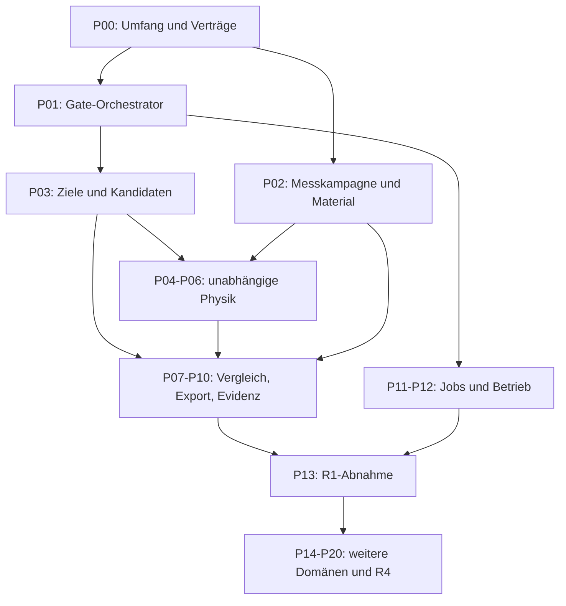

# Vollständiger Backend-Umsetzungsplan

Stand: 2026-10-05, Europe/Berlin. Ausgangscommit: eb8bd54.
Status: IN UMSETZUNG. Der erste Softwareabschnitt ist implementiert; siehe
Abschnitt 8. R1-R4 sind nicht abgenommen. Keine Abnahmeregel, kein bestehendes
Schema oder Golden und kein physischer Prüfstatus wurde dadurch verändert.

## 1. Ziel und Bedeutung von „fertig“

Crochet.AI soll aus einem eindeutigen DesignSpec und gemessenen Materialdaten
eine ausführbare CrochetIR-Konstruktion erzeugen, unabhängig rekonstruieren,
gegen Form- und Robustheitsanforderungen prüfen und nachvollziehbar exportieren.
Eine attraktive Vorschau oder eine erfolgreiche API-Anfrage genügt dafür nicht.

Wir arbeiten auf diese aufeinander aufbauenden Abnahmen hin:

| Abnahme | Verbindlicher Funktionsumfang | Bedeutung |
| --- | --- | --- |
| R0: heutiger Prototyp | Sechs analytische Testformen, zyklische feste Maschen, ein Garn, Live-Schritte, Fortschritt, PDF und Rückmeldung | Implementierter lokaler Pilot; NOT_VERIFIED / UNTESTED |
| R1: vollständiger analytischer 3D-Bereich | Nicht verzweigte geschlossene Rotationskörper, binäre SC-Zu-/Abnahmen, eindeutige Zielgeometrie, vollständige V0–V10-Kette, kalibrierte Profile und zuverlässiger lokaler Betrieb | Erstes vollständig abgenommenes Backend innerhalb dieses ausdrücklich begrenzten Bereichs |
| R2: breiter 3D-Bereich | Geeignete freie Meshformen, kontrollierte Öffnungen, Verzweigungen, mehrteilige Konstruktionen, Montage und unterstützte Farbwechsel | Zusätzliche freigegebene Amigurumi-Bereiche mit jeweils eigener vollständiger Abnahme |
| R3: weitere Produktbereiche | Flächige Arbeiten, Kleidungsstücke und ein ausdrücklich definierter Satz Spitzen-/Motivkonstruktionen | Separate Domänen; kein Umleiten durch den Amigurumi-Solver |
| R4: vollständige vereinbarte Backend-Version | Alle zugesagten R1–R3-Funktionen, veröffentlichte Kompatibilitätsmatrix, Betriebs-/Sicherheitsabnahme und alle B0–B12-Pakete angenommen | Erst hier gilt das gesamte vereinbarte Backend als vollständig |

R1 ist kein Ersatz für R2/R3. Ein begrenzter Compiler kann auch nach R4 nicht
jede denkbare Form häkelbar machen. Pro Bereich werden positive Referenzfälle,
zulässige Grenzen und explizite Ablehnungen festgeschrieben. Sichere Ablehnung
allein zählt nicht als Implementierung eines versprochenen Bereichs.

VERIFIED erfordert alle Pflichtgates eines versionierten, kalibrierten Profils.
PHYSICALLY_VERIFIED erfordert zusätzlich ein passendes tatsächlich gefertigtes
Holdout-Objekt. Ein Kalibrierprofil behauptet nicht, jedes neue Objekt sei bereits
gehäkelt worden. Benutzerfeedback hebt Prüfstatus niemals automatisch an.

## 2. Verifizierte Ausgangslage und wichtigste Lücken

Der Ausgangscommit enthält kanonische Modelle, unabhängige semantische Prüfung,
M1A-Textimport/-export, den begrenzten analytischen Solver, V0 für unterstützte
Meshprofile, lokale API/CLI und SQLite-Jobs. Der Prototyp ergänzt sechs Formen,
Sitzungsfortschritt, Rückmeldungen und PDF. Der letzte vollständige Softwarelauf
hat 837 Tests bestanden; das ist eine Ausgangsmessung, keine Backend-Abnahme.

Die entscheidende Verbindung fehlt noch: Die physikalische Projektion lässt
zwar bestimmte geschlossene SC-Konstruktionen zu, die experimentelle Flächen-
pipeline verarbeitet jedoch nur ausgerichtete, unverzweigte 1:1-Rundenstreifen.
Sie bildet keine vollständige Oberfläche mit Zu-/Abnahmen und Pol-/Ringkappen.
Kontakt wird diagnostiziert, aber noch nicht physikalisch aufgelöst. Es gibt
keinen produktiven V6-Konvergenznachweis, keine vollständige V7/V8-Ausführung
und keinen zusammenhängenden V0–V10-Abnahmeprozess. Der heutige Zähler-/Pitch-
Viewer ist daher kein physikalisches Vorhersagemodell.

Weitere Lücken: M1B/Montageexport, vollständige V10-Nachweiskette, empirische
Material-/Schwellenprofile, breitere Solver und die Betriebsabnahme. V0-Mesh-
Zulassung ist vorhanden; sie erzeugt aus einem Mesh noch keine Häkelanleitung.

Maßgebliche Quellen:

- [Paketstatus B0–B12](BACKEND_ACCEPTANCE_PLAN.md), insbesondere die aktuelle Matrix.
- [V0–V10](VERIFICATION.md), [Fehlerpolitik](FAILURE_POLICY.md).
- [Laufzeitgrenzen](BACKEND_RUNTIME.md), [experimentelle Forward-Pipeline](FORWARD_PIPELINE_V1.md).
- [Solverarchitektur](SOLVER_ARCHITECTURE.md), [Forward-Modell](FORWARD_MODEL.md).
- [Materialmodell](MATERIAL_MODEL.md), [physische Abnahme](PHYSICAL_VALIDATION.md).
- Code: physical_projection.py, forward_cells.py, forward_pipeline.py,
  analytic_solver.py, analytic_compile.py, pattern.py, certification.py,
  backend_api.py, job_store.py, job_worker.py und prototype_* im Paket crochet_ai.

## 3. Reihenfolge und Abhängigkeiten

Die Nummern sind Arbeitspakete, keine Gate-Nummern. Vorhandene Bausteine werden
weiterverwendet; ein Paket beginnt mit einer belegten Lückenliste, nicht mit
einem pauschalen Neubau. Alle Pakete sind geplant, nicht bereits erledigt.

| Paket | Ergebnis | Voraussetzung | Zuordnung |
| --- | --- | --- | --- |
| P00 | Freigabematrix und versionierte Schnittstellen | Ausgangsaudit | B0–B12 |
| P01 | Gate-Orchestrator mit realer Nachweiskette | P00 | B5, B6 |
| P02 | Messprotokolle, Datensätze und Profilregistrierung | P00 | B2, B11 |
| P03 | Eindeutige analytische Ziele und vollständige Kandidatenprüfung | P00, P01 | B2, B3 |
| P04 | Physische Konstruktion für Shaping, Ring und Abschluss | P00, P02, P03 | B4 |
| P05 | Anisotropes F0-Modell, Belastung und Kontaktreaktion | P04; Protokolle aus P02 | B4 |
| P06 | Unabhängiger V6-Konvergenznachweis | P05 | B4, B5 |
| P07 | V7-Geometrievergleich und Schwellenprofile | P03; Referenzgeometrie, anschließend P06 | B5 |
| P08 | V8-Materialrobustheit und verifizierte Kandidatenauswahl | P02, P06, P07 | B3, B5 |
| P09 | V9-Anweisungen, Parser und druckbare Exporte | P03; Schnittstellen aus P01 | B1 |
| P10 | V10-Provenienz und physische Evidenz | P01, P02, P06–P09 | B1, B5, B11 |
| P11 | Einheitliche API/CLI und dauerhafte Gesamtjobs | P01; inkrementell P03–P10 | B6, B7 |
| P12 | Sicherheits-, Ressourcen- und Installationsabnahme | P11 | B8 |
| P13 | Analytischer R1-Benchmark und Releaseabnahme | P00–P12 einschließlich physischer Holdouts | B12, R1 |
| P14 | Datei-/Meshadapter, Domänenrouter und geodätischer Solver | R1; vorhandenes V0 | B2, B9 |
| P15 | Topologieplanung, Frontiersolver und mehrteilige Montage | R1; unabhängige Topologie-Referenzfälle | B9 |
| P16 | M1B, Farben/Materialwechsel und 3D-Gesamtabnahme | P14, P15; P02–P12 erweitert | B1, B2, B9, R2 |
| P17 | Flächiger Solver mit Reihen, Motiven und Farben | Gemeinsamer Kern; eigene Domänenverträge | B10, Teil R3 |
| P18 | Kleidungs-Solver mit Maßen, Zugabe und Größenabstufung | P02; eigener Material-/Belastungsbereich | B10, Teil R3 |
| P19 | Spitzen-/Motivsolver mit ausführbaren Zusatzsemantiken | Eigene Semantik und unabhängige Referenzen | B10, Teil R3 |
| P20 | Gemeinsame breite Regression und Betriebsfreigabe | R2 und alle P17–P19-Abnahmen | B0–B12, R3/R4 |
| P21 | Optionale Sprache-/Bildinterpretation zu DesignSpec | Stabiler Kern und Domänenrouter | Optional, keine Abnahmeabkürzung |

Die Orchestrierungsstruktur wird früh gebaut. Fehlende Gates liefern zunächst
NOT_RUN, niemals Platzhalter-PASS. Später werden echte Gate-Implementierungen
angebunden. Auch in R1 bleibt die vorgeschriebene V0→V10-Ausführungsreihenfolge
je Kandidat erhalten; diese Entwicklungstabelle ändert sie nicht.

## 4. Konkrete Umsetzung und Abnahme des ersten vollständigen Bereichs

### P00. Umfang, Profile und Verträge festlegen

- Positive R1-Fälle, Maße, Maschen-/Rundengrenzen, Öffnungen, Stoffzustände und
  Anforderungen an Eingaben/Exporte tabellarisch festschreiben. Geschlossene
  Körper bleiben zunächst ein Garn, SC und binäre Zu-/Abnahmen. Ein offener
  Kalibrierschlauch wird als separater Messfall geführt.
- Für LoadingProfile, ForwardModelConfig, Modellkalibrierung, VerificationProfile,
  Geometrieschwellen, GateEvidence und Release-Manifest explizite Versionen und
  Hashprojektionen definieren. Diese Planbegriffe sind noch keine vorhandenen
  produktiven Schemas. Bestehende 1.0/1.1-Verträge bleiben gültig.
- Hypothetische und gemessene Werte trennen. Numerische Toleranzen erhalten
  Einheit, Begründung, Eigentümer und Kalibrier-/Konvergenzpfad. Keine
  unbegründeten Produktionsgrenzen oder stillen Standardwerte erfinden.
- Migrationsregeln für SQLite-Daten, alte Projekte und Exporte definieren.
  Mehr Materialparameter oder neue Operationen nur additiv/versioniert einführen.

Abnahme: Jeder zugesagte Bereich hat einen positiven Prüfbeleg, eine Grenze,
eine Versionsbindung und einen benannten Abschlussnachweis. Vertragskonflikte
werden vor der Implementierung durch ADR oder ausdrückliche Revision geklärt.

### P01. Prüfprozess als eigenständigen Kern bauen

- Einzelne Gate-Runner, immutable Nachweisdatensätze, Abhängigkeitsauflösung,
  Pflichtgate-Profile und deterministische Diagnoseaggregation implementieren.
- Vorhandene Input-/Schema-/Semantikprüfer anbinden. Unfertige V5–V10-Teile
  bleiben explizit fehlend. Solvererfolg und Job-SUCCEEDED bedeuten keinen PASS.
- Nach Pflichtfehlern spätere Gates auf NOT_RUN setzen; Diagnosemodus separat
  halten. Wiederverwendung nur bei identischen vollständigen Input-/Versionshashes.
- Gesamtergebnis aus Nachweisen ableiten: FAIL, fehlende Daten, Warnungen und
  Hypothesenschwellen nach FAILURE_POLICY behandeln. Kein Prozentwert als Ersatz.

Abnahme: Unabhängig konstruierte Gate-Vektoren testen Fehlerpriorität, fehlende
Evidenz, manipulierte Hashes, Wiederaufnahme und alle Gesamtzustände. Ein späterer
Erfolg darf einen früheren Pflichtfehler nicht verdecken.

### P02. Material und physische Kalibrierung parallel beginnen

- Kampagne, Prüfkörper, Rollen Pilot/Kalibrierung/Holdout/Reproduktion, Messungen,
  Instrumente und Medien als nachvollziehbare, unveränderliche Datensätze erfassen.
- Mindestens drei unabhängig gehäkelte Calibration-Tube-Proben für dasselbe
  deklarierte Garn-/Nadel-/Personen-/Stoffprofil vorbereiten. Die geschlossenen
  Zylinder aus dem Prototyp sind kein automatischer Ersatz für den Messvertrag.
- Maschen- und Rundenabstände getrennt in mm ableiten. Messungen, Endeffekt-
  Ausschlüsse, Wiederholungen und Unsicherheitsbasis vor Auswertung festlegen.
- Sphere-Reihe und Hourglass-Holdout vorbereiten; Füllmassen/Zustände ausdrücklich
  protokollieren. Die heutige Kugel/Kapsel/Birne-Reihe dient zunächst als Pilot.
- Steifigkeit, Schub, Biegung und Füllungsparameter nur mit dafür geeigneten
  Prüfkörpern und Sensitivitäts-/Identifizierbarkeitsanalyse schätzen. Drei
  Maschenproben identifizieren kein vollständiges mechanisches Modell.
- Profile und Schwellen vor Holdout-Fertigung einfrieren. Gescheiterte Holdouts
  bleiben erhalten; nach Anpassung neue Profilversion und neue Holdouts verwenden.

Abnahme: Rohdaten, Ableitungscode und Profile sind reproduzierbar verbunden.
Ein zu dünner Datensatz bleibt eine Hypothese. Die Personen außerhalb dieses
Rechners liefern die tatsächlichen Proben; Softwarearbeit läuft parallel weiter.

### P03. Analytischen Solver vervollständigen und unabhängig absichern

- Existierende global gekoppelte ganzzahlige Zählsuche und IR-Kompilierung
  behalten. Restlücken für Randbedingungen, Kandidatenvielfalt, Shaping-Verteilung
  und nachgewiesene Anwendbarkeit schließen; keine unabhängige Rundung je Runde.
- Eindeutige rekonstruierbare Zieloberflächen für jede R1-Form liefern. Ein
  Radialprofil r(s) kodiert nicht allgemein das Vorzeichen der axialen Bewegung.
  Die zulässige Rekonstruktionskonvention oder eine additive Zielrepräsentation
  muss vor V7 geklärt sein; keine Zieloberfläche aus ungesicherten Annahmen erfinden.
- Zieladapter, Flächenabtastung, Koordinatenrahmen und Charakteristiklänge binden.
  Zielgeometrie bleibt ausschließlich beim Solver und späteren V7-Vergleich.
- V5 unabhängig von Solverflags umsetzen: Reichweite, Invarianten, Work-Budgets,
  deterministische Reihenfolge, Abschluss sowie Naht-/Schnittzählung überprüfen.
- Aktuelle Count-then-Phase-Suche korrekt als gestuftes Verfahren deklarieren;
  nur eine tatsächlich belegte globale Optimalität behaupten.

Abnahme: Unabhängige kleine vollständige Suchorakel, dezimale Maßfälle, Pole,
Engstellen, Hourglass, reproduzierbare Kandidaten und exakte Budgetgrenzen.
Budgetende, bewiesene Unmöglichkeit und späterer Geometriefehler bleiben getrennt.

### P04. Physische Konstruktion für die tatsächlichen Muster vervollständigen

- Projektion, Graph, Zell-/Flächenerzeugung und Initialisierung für binäre
  Zu-/Abnahmen sowie MAGIC_RING und CLOSE erweitern.
- Unterschiedliche Rundenzahlen, Zellübergänge und Polkappen mit einer expliziten
  Zuordnung zu Attachment-Locations modellieren. Oberfläche und Orientierung
  unabhängig prüfen; IR-Abschluss allein erzeugt noch kein korrektes Flächenmesh.
- Ruhelängen/-winkel aus Material und deklarierten Modellregeln ableiten.
  Initialisierungsgeometrie darf nicht selbst als Kalibrierbeweis dienen.
- Für den offenen Kalibrierkörper eigene zulässige Grenzen festlegen. Kein
  stilles Zuschließen oder Druckterm auf einer offenen Fläche.

Abnahme: Handprüfbare Minimalfälle für Plain/INC/DEC, Start und Ende; positive
und ungültige lokale Anordnungen, keine unbeabsichtigten Löcher/T-Junctions,
eindeutige Inzidenz/Orientierung, keine versteckten Zielabhängigkeiten.

### P05. F0-Energie, Belastung und Kontaktreaktion ergänzen

- Vorhandene Stretch-/Shear-/Bending-Terme erweitern und ihre Ableitungen gegen
  unabhängige Formeln bzw. geeignete Differenzen-/Symmetrieprüfungen absichern.
- Dimensionskonforme Loading-/Boundary-Terme einführen. Gefüllte Körper gehören
  zum gewünschten 3D-Bereich: Druck/Füllung nur aus gemessenen oder deklarierten
  unabhängigen Daten, niemals aus dem gewünschten Zielvolumen ableiten.
- Broad-Phase und bestehende exakte Kontaktdiagnostik weiterverwenden; zusätzlich
  Kontaktreaktion, zulässige Nachbarschaft und erforderliche Dicken-/Abstands-
  regeln modellieren. Kontaktfreie Endkoordinaten allein beweisen keinen sicheren
  Optimierungspfad; Durchdringen zwischen Iterationen ebenfalls verhindern.
- Gedächtnis-, Element- und Kontaktpaarbudgets sowie notwendige Aktualisierung
  der Kollisionsdaten pro numerischem Schritt eindeutig begrenzen.

Abnahme: Nichttriviale deformierte Fälle mit Reaktion auf Last und Kontakt;
Selbstüberschneidung, Annäherung, Falte, Pol und Nahtbereich. Unaufgelöste
Kollisionen dürfen keine für V7 zugelassenen Koordinaten liefern.

### P06. V6-Konvergenz und Unabhängigkeit herstellen

- Dimensionsgebundene Kraft-, Schritt-, Energie- und Kontaktkriterien,
  Starrkörperentfernung, mehrere unabhängige Initialisierungen und Umgang mit
  mehreren Gleichgewichten definieren. Modellkalibrierung aus P02 einbinden.
- Zustände CONVERGED, INVALID_MODEL_INPUT, DIVERGED, UNRESOLVED_COLLISION,
  BUDGET_EXHAUSTED und NUMERICAL_FAILURE vollständig implementieren.
- Nur CONVERGED liefert autoritative vorhergesagte Geometrie. Debug-Koordinaten
  und die heutige EXPERIMENTAL_FORCE_BALANCED-Meldung sind kein V6-Ersatz.
- Provenienz-/Farb-/Zieländerungen ohne physische Bedeutungsänderung dürfen
  Projektion, Cache, Startzustand und Simulation nicht verändern.

Abnahme: Konvergenz-/Auflösungsstudien, bekannte Gleichgewichte, Skalenfälle,
Mehrfachstarts, Fehlerpfade und Ziel-Leakage-Mutationen. Eine plausible Ansicht
oder ein kleiner Energiewert darf keinen falschen Konvergenznachweis erzeugen.

### P07. Unabhängigen V7-Geometrievergleich implementieren

- Deterministische Flächenabtastung, Referenzoberflächen und feste Ansichten
  definieren. Nur erlaubte starre Registrierung, keine Größenanpassung oder
  Verformung der Simulation an das Ziel.
- Symmetrischen Chamfer, robustes Hausdorff-Perzentil, Silhouetten-IoU je Ansicht,
  Schnittkonturen/-flächen, Volumen bei gültig geschlossenen Flächen, Landmarken,
  Normalen und exakte Topologie implementieren. Krümmung bleibt diagnostisch,
  bis ein entsprechender kalibrierter Gate-Vertrag besteht.
- Profil legt Anwendbarkeit, Operator, Einheit, Schwelle und Herkunft je Metrik
  fest. Fehlende erforderliche Maße dürfen nicht aus einem Mittelwert verschwinden.

Abnahme: Unabhängige synthetische Paare mit bekannten Abständen/Volumina und
gezielten Defekten: falsche Größe, verschobene Landmarke, enge Taille, offene
Fläche, gute Durchschnittsform mit lokaler Fehlstelle. Gleichheit sowie Werte
direkt unter/über jeder Schwelle prüfen. Hypothesenschwellen bleiben EXPERIMENTAL.

### P08. V8-Robustheit und Auswahl verifizierter Kandidaten

- Explizite Unsicherheitsbereiche und ein deterministisches Szenarioprofil
  aus Materialantworten ableiten. Fehlende Grenzen und unzulässige Korrelationen
  nicht durch feste Prozentwerte oder erfundene Verteilungen ersetzen.
- Pro Pflichtszenario V6 und die erforderlichen V7-Prüfungen ausführen; Gesamt-
  budget, Szenarienzahl, Abbruch und Cacheversionen nachvollziehbar begrenzen.
- Schlechtesten Fall und vollständige Fehlerliste speichern. Stichproben sind
  empirische Abdeckung, kein Beweis für jedes kontinuierliche Zwischenmaterial.
- Erst die V0–V8-feasible Kandidatenmenge lexikografisch vergleichen: Nähte,
  Fadenschnitte, Wiederansätze, definierter Fehlervektor, Komplexität, Hash-Tiebreak.
  Feasibility-Auswahl ist noch kein veröffentlichter VERIFIED-Export; V9/V10 folgen.

Abnahme: Fälle mit nominalem PASS und Unsicherheits-FAIL, frühem Budgetende,
mehrdeutigem Material und identischen Kosten. Kein teilweise geprüfter Kandidat
wird als robust gewählt; keine Nahtpräferenz überstimmt eine harte Formgrenze.

### P09. V9, Anleitungen und PDF zuverlässig abschließen

- Bestehenden M1A-Parser/-Binder/-Exporter weiterverwenden; alle R1-Konstruktionen
  mit benötigten DE-/US-/UK-Exporten durch unabhängigen semantischen Round Trip
  absichern. Einzelne Kürzel/Marker und Ausführungsreihenfolge erhalten.
- Sichtbare verständliche Vorbereitung, Einstichstellen, Zu-/Abnahmen, Füllen,
  Restloch-Abschluss und Vernähen liefern. Keine neue Operation still in Prosa
  einführen, die nicht in der akzeptierten Konstruktion bzw. Abschlussregel steht.
- PDF und kompakte Runden aus derselben freigegebenen Anweisung erzeugen.
  Gruppenexpansion und sichtbare Anker müssen die Semantik verlustfrei erhalten;
  wo nötig kontrollierten Anweisungstext sichtbar mit ausgeben. Eingebettete IR
  oder versteckte Zertifikate dürfen fehlende Textanweisungen nicht ersetzen.
- Schriftabdeckung, Umbrüche, lange Garnbezeichnungen, Status, Profil- und
  Musterkennung sowie den tatsächlichen Datei-Download prüfen.

Abnahme: Unabhängige lokalisierten Positiv-/Negativfälle, Export→Parse→Semantik,
PDF-Inhaltsvergleich und gerenderte Seiten. Einen nativen Download zusätzlich
in einem unterstützten normalen Browser bestätigen; die bekannte unbestätigte
Codex-Downloadbeobachtung bleibt bis dahin als offene Transportprüfung sichtbar.

### P10. V10-Provenienz und physische Abnahme verbinden

- Design, Material, Quelle, IR, Solver, Modell, Laden, Metriken, Szenarien,
  Export/Parser, Softwarecommit und gesamte Gate-Evidenz durch Hashes/Versionen
  verbinden. Das heutige detached CertificationManifest allein genügt nicht.
- Physische Rollen, Musterabweichungen, Messungen und eingefrorene Schwellen an
  die genaue Anleitung binden. Rohfeedback zunächst als selbstberichtet erfassen.
- Ergebnisse unterschiedlicher Muster oder geänderter Materialien nicht
  zusammenführen. Superseding-Records statt Überschreiben verwenden.

Abnahme: Manipulierte/fehlende Nachweise, veraltete Versionen, falsche Probe,
fehlgeschlagene Holdouts und widersprüchliche behauptete Prüfzustände ablehnen.
Profilweite CALIBRATED-Evidenz und artefaktbezogene PHYSICALLY_VERIFIED-Evidenz
werden getrennt ausgewiesen.

### P11. API/CLI, Sitzungen und Jobs auf den gesamten Prozess erweitern

- Gemeinsamen Anwendungsdienst für Prototyp und Compiler schaffen, soweit die
  unterschiedlichen Auftrags-/Artefaktverträge dies tatsächlich benötigen.
  Semantisch unterschiedliche Speicher bleiben getrennt; keine erzwungene
  Datenbankmigration allein zur Vereinheitlichung.
- Job-Anfrage enthält versioniertes Design, Material, Ziel, Budget und Prüfprofil.
  Antwort enthält Gate-Vektor, Kandidaten, Status, vollständige Diagnoseursachen
  und quellgebundene abrufbare Artefakte.
- Ganze Prüfketten dauerhaft ausführen: Idempotenz, atomare Veröffentlichung,
  Abbruch, Prozessende, Wiederaufnahme ausschließlich gültiger unveränderter
  Zwischenartefakte, Lease-Konflikte, Quoten und Datensicherung.
- Fortschritt und Rückmeldungen an die exakte Musterversion binden; Konflikte
  explizit anzeigen. Schnittstellen für spätere separate Mobile-App dokumentieren.

Abnahme: API und CLI liefern dieselben kanonischen Ergebnisse; Absturz/
Abbruch führt weder zu Teil-IR noch zu veröffentlichtem Teil-PASS. Alte Projekte
bleiben lesbar oder erhalten einen dokumentierten expliziten Versionsfehler.

### P12. Sicherheit, Ressourcen und Installation abnehmen

- Existierende Eingabe-/Pfad-/Hostgrenzen behalten. Untrusted Mesh-/Text-/PDF-
  Eingaben, Prozessisolierung, reale Speicher-/Diskgrenzen, Timeout, Disk-full,
  Payloadquoten, Wiederherstellung, Exportfehler und Datenaufbewahrung prüfen.
- Ressourcenmessungen als Telemetrie vom kanonischen Ergebnis trennen;
  betriebliche Zeitlimits nicht als mathematische Unmöglichkeit ausgeben.
- Abhängigkeiten/Lizenzen/Notices, reproduzierbaren Wheelinhalt, Offlinefähigkeit,
  saubere Installation und Betrieb außerhalb des Repositorys nachweisen.
- Erster Betrieb bleibt lokal und ohne Cloudkosten. Vor einer später ausdrücklich
  beauftragten Mehrbenutzerbereitstellung zusätzlich Authentisierung, Autorisierung,
  Mandantentrennung, Quoten und Schutz der privaten Messdaten abnehmen. Ohne
  diese Abnahme darf der Loopback-Prototyp nicht als öffentlicher Dienst gelten.

Abnahme: Keine Preis-/Cloudannahmen, keine Geheimnisse in Repository/Logs,
keine Pfadausbrüche, verlorenen Aufträge oder falschen Erfolgsmeldungen bei
Ressourcenfehlern. Sicherungs-/Wiederherstellungstest und Installationstest bestehen.

### P13. R1-Abnahme auf eingefrorenen Referenz- und Holdout-Fällen

- Referenzmanifest mit sechs aktuellen Formen und weiteren adversarialen Fällen
  führen: kleine/große gültige Körper, dezimale Maße, Engstelle/Hourglass,
  Budgetgrenzen, Materialvariation sowie gezielt nicht unterstützte Konstruktion.
- Ein kompletter Request durchläuft V0–V10, erzeugt echte autoritative Vorhersage,
  vollständige Prüfbelege, akzeptierten Export und dauerhafte Artefakte oder einen
  präzisen, reproduzierbaren Fehler. Positive Fälle müssen tatsächlich bestehen.
- Computationale Benchmarks und physische Holdouts aus getrennten Kampagnen
  durchführen. Goldens/Schwellen vor Release einfrieren und menschlich prüfen.
- Ganze Python-/Property-/Stateful-/Metamorphic-/Integrationssuite, unabhängige
  Node-Konformität, Lint/Typen, Installation und Betrieb ausführen.

Abnahme: Alle R1-Pflichtfunktionen und deren Grenz-/Fehlerfälle sind belegt,
alle behaupteten Kalibrierungen besitzen gültige Daten, und keine Profilpflicht
ist NOT_RUN. Erst dann R1 abschließen; B9/B10 bleiben ausdrücklich offen.
Ein bestandener Holdout stützt nur das eingefrorene Profil und den geprüften
Material-/Personen-/Form-/Belastungsbereich. Er bestätigt weder beliebige neue
Formen noch andere Garne, Personen oder Füllzustände.

## 5. Umsetzung der übrigen versprochenen Bereiche

### P14. Eingabeadapter und geodätische freie Formen

- Die bisher kanonische JSON-Meshgrenze um ausgewählte, lizenzgeprüfte Datei-
  adapter ergänzen; Einheiten, Indizes, Orientierung und Quellhashes explizit
  binden. Unterstützte Formate vorab nennen; keine stillen Meshreparaturen.
- Router anhand definierter Anwendbarkeit: analytisch, geodätisch oder
  Frontier. Mehrere begrenzte Versuche sind zulässig; keine erzwungene Klassifikation.
- Geodätische Seeds, Distanzfelder, Levelsets, Singularitäten, Kurvenordnung,
  gekoppelte Rundenzahlen und Kompilierung nach GEODESIC_SOLVER implementieren.
- Mesh-V0 wiederverwenden; offene, flächige und Spitzen-Domänen benötigen ihre
  eigenen Adapter-/Profilabnahmen. Skalierungs-/Retessellierungsfälle prüfen.

Abnahme: Freie nicht verzweigte positive Referenzformen laufen durch dieselbe
unabhängige V0–V10-Kette. Instabile Levelsets, ungeeignete Topologie und Budget-
ende sind reproduzierbare Ablehnungen; importierbar bedeutet nicht generierbar.

### P15. Topologie, Frontier und mehrteilige Konstruktionen

- Solverprivate Construction Graphs aus Verzweigungs-/Öffnungsereignissen bauen;
  keine Gleichsetzung mit CrochetIR. Ownership-Ledger und branch obligations
  gemäß TOPOLOGY_SEAMLESS durch unabhängige Referenzmodelle prüfen.
- SPLIT, RESERVE, REATTACH, JOIN, Öffnungen, Ausrichtung und Abschluss explizit
  planen/kompilieren; danach begrenzte Frontier-Suche mit Rollback und festen
  Zustands-/Kontakt-/Komplexitätsbudgets entwickeln.
- Einfache mehrteilige, genähte Referenzkonstruktion vor weitergehender
  Nahtoptimierung anbieten. Nahtfreiheit nur zwischen bereits formgültigen
  Kandidaten optimieren; alternative Montagen einzeln prüfen.
- Physische Flächen, Verbindungsmodelle und Kontakt für die neuen Konstruktionen
  erweitern. Y-Branch und Zwei-Bein-Fälle inklusive sämtlicher Abschlusszustände.

Abnahme: Unabhängige Stateful-Ledger-Tests, keine verlorenen/mehrfach besetzten
Frontiers, exakte Naht-/Schnittzählung, gültige Montageorientierung sowie
Simulations-/Geometrie-/Robustheitsnachweise für positive verzweigte Fälle.

### P16. M1B, Farben und R2-Gesamtabnahme

- Sichtbare Grammatik für Komponenten, Reservierungen, Wiederansätze, Montage,
  Öffnungen, Material-/Farbwechsel und erforderliche weitere Grundmaschen
  ergänzen; jede Fähigkeit explizit versionieren und round-trip-prüfen.
- Mehrere reale Materialprofile brauchen eine explizite Registry: Farbe allein
  darf keine mechanischen Eigenschaften auswählen. Farbwechsel mit gleichem
  Material und echter Garn-/Materialwechsel bleiben verschiedene Fälle.
- Restlücken des bestehenden kanonischen Semantikbereichs vollständig belegen;
  nicht unterstützte neue Shaping- oder Spezialmaschen erst mit eigenem
  ausführbaren Vertrag zulassen.
- Assembly-Exporte mit Positions-/Orientierungsangaben und abschnittsweisem
  Fortschritt liefern. Y-Branch-Holdout und freie Formen in die Freigabematrix.

Abnahme: DE/US/UK-Round-Trips des freigegebenen M1B-Bereichs, Materialbindungen,
mehrteilige Proben und ganze V0–V10-Kette. R2 erweitert R1, ohne dessen alte
Artefakte, Schema-/Materialbindungen oder goldene Erwartungen zu verändern.

### P17. Flächige Arbeiten

Eigener DomainSpec-/Adapterbereich für Reihen, Raster, Wiederholungen, Motive,
Ränder und Farben. Exakte gekoppelte Maschen-/Reihenzahlen sowie kontrollierte
Verbindungen kompilieren. Materialantworten für LINEAR getrennt von CYCLIC
auflösen. Physische 2D-/Falten-/Randwirkung und eigene geometrische/maßbezogene
Schwellen prüfen; keine geschlossene 3D-Volumenprüfung vortäuschen.

Abnahme: Positive Rechteck-/Form-/Motivfälle, Umkehrung/Turning, Randanschlüsse,
Farben, Fehlerfälle und V0–V10 unter einem passenden flächigen Profil.

### P18. Kleidungsstücke

Eigene Eingaben für Körpermaße, Maßtoleranz, Bewegungs-/Passformzugabe, Teile,
Konstruktionsstil und Größenabstufung. Körperkontakt/Schwerkraft/Lastzustände
und dafür geeignete identifizierte Materialantworten separat modellieren.
Ärmel-/Armloch-/Halsöffnungen, Nähte und Montage ausdrücklich konstruieren.
Passform verlangt eigene Messkampagnen und Holdouts je deklariertem Größen-/
Materialbereich; der aktuelle F0-Druckkörper ist kein Kleidungs-Simulator.

Abnahme: Ein zunächst benanntes einfaches Kleidungsstück samt Größenmatrix,
Maß-/Bewegungsanforderungen, vollständigem Export, physischem Passformnachweis
und Abnahmeprofil. Breiterer Kleidungsumfang wird einzeln ergänzt.

### P19. Spitzen und Motive

Zuerst einen endlichen zugesagten Motiv-/Maschensatz und ausführbare Semantik
für benötigte Chain-Spaces, Cluster oder weitere Primitive festschreiben.
Neue Maschen dürfen nicht allein durch ein Textkürzel entstehen. Dann typisierte
Motiv-/Topologiegraphen, Anschlüsse, Wiederholungen, Randbedingungen, Material-
antworten und einen dafür passenden Rekonstruktions-/Vergleichsbereich bauen.

Abnahme: Positiver Motivreferenzsatz, unabhängige Attachment-/Topologieorakel,
mehrdeutige/fehlende Anschlüsse als Fehler, Round Trips und passende physische
Holdouts. Weitere Spezialmaschen sind zusätzliche versionierte Fähigkeiten.

### P20. Vollständige gemeinsame Releaseabnahme

Alle zugesagten Bereiche aus R1–R3 in einer Versions-/Fähigkeitsmatrix prüfen;
B0–B12 dürfen keine zugesagte fehlende Funktion enthalten. Ganze Gate-Ketten,
kompatible Altprojekte, Domänenrouting, Ressourcen-/Crash-/Migrations-/Backup-
prüfungen und veröffentlichbare Lizenz-/Evidenzmanifeste abnehmen. Backend-
Fertigstellung bleibt von einer späteren Web-Veröffentlichung oder separaten
Mobile-App getrennt; deren Schnittstellen sind vorbereitet.

Abnahme: Reproduzierbarer Releasebericht nennt sämtliche Fähigkeiten,
Pflichtgates, Profilgrenzen, verbleibende Forschungsfunktionen und tatsächliche
physische Evidenz. Nicht bestandene zugesagte Fähigkeiten verhindern R4.

### P21. Optionale AI-Eingabe

Sprache/Bilder dürfen nur einen DesignSpec-Vorschlag mit aufgelösten oder
sichtbar fehlenden Maßen/Einheiten liefern. Unklare Angaben werden geklärt;
kein LLM erzeugt autoritative Maschenzahlen oder überspringt Prüfungen.
Modellwahl bleibt konfigurierbar; kein global erzwungenes Chatmodell und kein
versteckter kostenpflichtiger Dienst. Diese Erweiterung ist keine Voraussetzung
für den deterministischen Backend-Abschluss.

## 6. Einheitliche Fertig-Kriterien für jedes Paket

Ein Paket wird erst nach allen zutreffenden Nachweisen abgeschlossen:

1. Dokumentierter Eingabe-/Ausgabe-/Fehlervertrag; alle benötigten Versionen,
   Grenzen, Einheiten, Budgets und Invarianten benannt.
2. Ausführbare Implementierung plus echte positive Fälle; kein TODO-/Mock-/
   Ablehnungsadapter als fertige Fähigkeit.
3. Unabhängige Negativ-, Grenz-, Property-/Stateful-/Metamorphic-Tests passend
   zum Risiko; Produktionslogik nicht als ihr eigenes Testorakel verwenden.
4. Solver und unabhängigen Verifier in getrennten Arbeitsaufträgen ändern;
   Common-Mode-Risiken ausdrücklich prüfen.
5. Passende API-/CLI-/Installationsintegration und beweisbare Provenienz.
6. Zugeordneter Gate-Nachweis und aktualisierte B0–B12-/Fähigkeitsmatrix.
7. Bei numerischen/physikalischen Behauptungen: Konvergenz-/Kalibrier-/Holdout-
   evidence im ausdrücklich angegebenen Geltungsbereich.
8. Keine abgeschwächten Prüfungen oder automatisch aktualisierten Goldens.

Implementation folgt AGENTS.md: Hauptchat entscheidet und integriert; zunächst
ein begrenzter Luna-Worker mit zusammenhängendem Paket und Zieltests, maximal
ein unabhängiger Reviewer für riskante Mathematik/Verifikation. Keine rekursive
Delegation. Nach zwei erfolglosen Reparaturen desselben Fehlers neu eingrenzen.
Kosten-/Tokenmessungen nur berichten, wenn vorhanden; unbekannte Werte bleiben null.

## 7. Menschliche/externe Voraussetzungen

- Tatsächliches Garn, Nadel, anonymisiertes Spannungsprofil, mindestens drei
  Kalibrierschläuche und anschließende getrennte Holdouts gemäß P02. Weitere
  Mechanikparameter benötigen eigene Identifizierbarkeitsbelege.
- Menschliche Freigabe neuer Golden-Manifeste und kalibrierter Profile/
  Schwellen gemäß TEST_STRATEGY und PHYSICAL_VALIDATION. Software bereitet die
  vollständigen reviewbaren Artefakte vor; die Freigabe ist kein automatischer Job.
- Eine spätere externe Bereitstellung benötigt einen eigenen Betriebsumfang;
  dieser Plan beauftragt weder Hosting noch Versand privater Messdaten.

Diese Voraussetzungen blockieren nicht das Schreiben/Prüfen der Software,
aber sie verhindern die entsprechenden kalibrierten bzw. physischen Claims.
Es werden keine festen Fertigtermine aus den bisherigen Testzahlen abgeleitet.
Nach P00/P03/P04/P06 lassen sich Aufwand und konkrete Risiken neu bewerten.

## 8. Ausgeführter Abschnitt und nächster Arbeitsauftrag

Der erste ausgeführte Abschnitt umfasst die versionierte B0-B12-Fähigkeitsmatrix
und ein unveränderliches Prüfprofil (Teil P00), V0-V10-Orchestrierung mit realem
Mesh-V0, V1/V2/V3-Adaptern und ausdrücklich unvollständigem V4 (P01-Kern),
append-only Kalibrierkampagnen, strikte Messdaten, Referenzmessung je unabhängiger
Probe und ungeprüfte Materialentwürfe (Teil P02). Das PDF-Messpaket ist verfügbar;
der offene Schlauch benötigt weiterhin einen eigenen IR-/Anleitungsgenerator.
DE/US/UK-M1A-Text-Roundtrips laufen als V9 (Teil P09). API, CLI und vorhandene
durable Jobs führen den Checkpoint aus (Teil P11); Job-SUCCEEDED wird nicht mit
Musterverifikation gleichgesetzt.

[VERIFICATION_PIPELINE.md](VERIFICATION_PIPELINE.md) und
[CALIBRATION_CAMPAIGNS.md](CALIBRATION_CAMPAIGNS.md) dokumentieren Verträge,
Schnittstellen und Grenzen. P03 ergänzt inzwischen eine eindeutige Zielrepräsentation
für Kugel/Ellipsoid mit eigenem idealem V0, signierten Koordinatenachsen,
endlichen unterscheidbaren Kardinalpunkten und begrenzter Zielabtastung.
Generische Radialprofile bleiben wegen fehlender axialer Vorzeichen unbestimmt;
native Zylinder-/Kegel-Schnittstellen bleiben für diese Zulassung offen.
[ANALYTIC_TARGET_V1.md](ANALYTIC_TARGET_V1.md) dokumentiert den Teilumfang.

Ein separater P04-Baustein erzeugt jetzt aus der zielfreien physischen Projektion
geschlossene kombinatorische Dreiecksflächen für Plain/INC/DEC samt Ring- und
Abschlusskappen. Eingaben, zyklische Reihenfolge, Hashbindung und genaue
Vertex-/Flächenbudgets werden geprüft; unabhängige Tests prüfen Kanteninzidenz,
Orientierung, Vertex-Links und Eulerzahl. Der Aufbau ist ausdrücklich
TOPOLOGY_ONLY, noch keine physische Einbettung oder unabhängiger V4-Verifier.
[FORWARD_CLOSED_CELLS_V1.md](FORWARD_CLOSED_CELLS_V1.md) beschreibt die neue
Zellregel und ihre Grenzen. Beide Bausteine sind über API/CLI/Jobs inspizierbar.

Ein unabhängiger Flächen-Auditor ergänzt jetzt Kanteninzidenz, Orientierung,
zusammenhängende zyklische Vertex-Links, Komponenten, Eulerzahl und rationale
Betti-Dimensionen. Handgeschriebene Kugel-, Torus-, getrennte und gepinchte
Referenzfälle prüfen ihn unabhängig vom Zellgenerator. API, CLI und Jobs können
den Nachweis abrufen; V4 bindet ihn samt Budgets und Hashes in die Prüfbelege ein.
Fehlerhafte Flächen führen zu FAIL. Die erfolgreiche Flächenprüfung ersetzt
noch keinen unabhängigen Beweis der Abbildung von Mascheninzidenz auf Zellflächen.
Siehe [SURFACE_TOPOLOGY_AUDIT_V1.md](SURFACE_TOPOLOGY_AUDIT_V1.md).

Der separate Prüfer [CLOSED_CELL_CONFORMANCE_V1.md](CLOSED_CELL_CONFORMANCE_V1.md)
liest die Quell-IR direkt und prüft sämtliche Maschen-/Flächen-Slots, Frontiers
und Abschlusskappen gegen die festgelegte Zellregel. V4 kann damit im geschlossenen,
einteiligen SC-Amigurumi-Bereich PASS erreichen, wenn beide Nachweise und die
DesignSpec-Topologie passen. Nicht unterstützte Konstruktionen bleiben INDETERMINATE;
V5 prüft den unten beschriebenen Teilumfang und bleibt ohne vollständige
Suchbelege INDETERMINATE; V6-V8 und V10 bleiben NOT_RUN. Echte Kalibrierung, umfangreichere
Exporte, Simulation, weitere Solver und Betriebsabnahme sind offen. Damit wird
weder P00/P02/P09/P11 noch das Gesamtbackend als vollständig abgenommen markiert.

Nächster Abschnitt: generische analytische Ziele aus P03 mit expliziten axialen
Koordinaten versionieren; vollständige unabhängige V5-Suchbelege ergänzen.
Der [V5-Kandidatenprüfer](ANALYTIC_CANDIDATE_CLAIMS_V1.md) rekonstruiert nun
Rundenzahlen, binäre SC-Übergänge, Shaping-Verteilung, Phasen und
Konstruktionsmengen direkt aus CrochetIR. Er prüft aufgezeichnete Parameter,
Grenzwerte und Materialbedingungen. Unrichtige Aussagen führen zu FAIL;
fehlende eingabegebundene Suchverläufe, tatsächliche Arbeitsnachweise,
Zählfenster und deterministische Kandidatenauswahl bleiben INDETERMINATE.
Geprüfte Arbeitszähler-Grenzen bestätigen noch nicht die tatsächliche Suche.
Der separate [Suchverlauf-Erzeuger](ANALYTIC_SEARCH_TRACE_V1.md) protokolliert
nun Eingabebindungen, Zählfenster, Hypothesen, DP-Schichten, Arbeit und Abbrüche.
Neue Pilotprojekte speichern außerdem die Verknüpfung des Vorschlags zur finalen
Nullphasen-Anleitung. Der nächste V5-Abschnitt muss diese ungeprüften Nachweise
unabhängig zulassen und prüfen; vorhandene Trace-Hashes allein genügen nicht.
Die unabhängigen Prüfungen des Flächenkomplexes und seiner Quell-/Zell-Zuordnung
sind für den dokumentierten geschlossenen SC-Bereich implementiert.
Physische Einbettung, Restzustände und
Shaping-Energie folgen separat. Solver- und Verifier-Arbeit bleiben getrennte
Aufgaben. Loading-/Modellprofile aus P00,
offene Schlauchkonstruktion und die vollständige P02-Unsicherheit/Provenienz
werden dabei ergänzt. Alle verbleibenden Paket-Abnahmen oben bleiben verbindlich.

Der bestehende Pilot bleibt für Häkelrückmeldungen nutzbar. Die vollständige
Backend-Abnahme bleibt offen und der physische Status bleibt UNTESTED.

### Fortschreibung 2026-10-06: unabhängige Suchprüfung

Der [Trace-Prüfer](ANALYTIC_TRACE_AUDIT_V1.md) prüft nun Kugeln und Ellipsoide
mit gleichen Achsen vollständig innerhalb seines rechnerischen Bereichs:
Eingabebindung, Samples, Zählfenster, beide DP-Pässe, Phasenoptimum und exakte
Tie-Breaks, Schichtarbeit/Abbrüche, Hypothesenpräfix und globale Budgets. Originale
CrochetIR-Vorschläge binden Rundenzahlen, Phasen, Parameter und Vorschlagshashes.
API, CLI, Jobs und optionales V5-Suchevidence sind integriert. Falsche Nachweise
führen zu FAIL, fehlende Artefakte oder nicht unterstützte Sampler bleiben offen.
Gespeicherte Pilotprojekte besitzen bisher nur den ursprünglichen Vorschlagshash;
vollständige Artefaktpersistenz und finale Zuordnung folgen als separate Aufgabe.
Physikalische Kandidatenauswahl, Quellenauthentisierung und V6-V8/V10 sind dadurch
nicht abgenommen. Die gesamte R1-R4- und B0-B12-Abnahme bleibt verbindlich.

Für schnelleres Vorankommen werden zusammenhängende Umsetzungspakete bis zur
API gebündelt, unabhängige Teilaufgaben parallel bearbeitet und die gesamte
Testsuite einmal am Integrationspunkt ausgeführt. Laufzeitmessungen ersetzen
Vermutungen über langsame Tests. Nächste größere Pakete bleiben eindeutige
Zielkoordinaten und das vollständige zielunabhängige physikalische Shaping-Modell.

### Fortschreibung 2026-10-06: vollständige Vorschlagspersistenz

Neue Pilotprojekte speichern die vollständigen ursprünglichen CrochetIR-
Vorschläge in einem versionierten, gehashten
[Paket](PROTOTYPE_PROPOSAL_BUNDLE_V1.md). Die bestehende atomare Projektablage
umfasst die Originale; Neustart, Fortschritt, Rückmeldungen und JSON-Downloads
erhalten sie. Strikte Zulassung bindet Trace, Eingaben, Reihenfolge und finale
Projektidentität. Beschädigte oder nur teilweise vorhandene Pakete führen zu
einem ausdrücklichen Fehler. Alte Projekte werden nicht nachträglich ergänzt.
Der vorhandene unabhängige Prüfer erhält diese Originale über die lokale API;
Solver und Prüfer werden in diesem Paket nicht geändert. Die unabhängige finale
Zuordnung und physikalische Kandidatenauswahl bleiben offen, ebenso V6-V8/V10.

Ein Profil der gespeicherten Kugelprüfung zeigt viele wiederholte Schema-/IR-
Validierungen, besonders in den drei V9-Sprach-Roundtrips. Eine separate
Optimierung soll unveränderliche, an die konkrete Anfrage gebundene Prüfdaten
wiederverwenden und sämtliche Zulassungsgrenzen erhalten. Keine globale mutable
Cache-Lösung und kein Überspringen unabhängiger Prüfungen. Diese Messung ist
ein Ansatzpunkt; eine Beschleunigung wurde noch nicht umgesetzt oder belegt.

### Fortschreibung 2026-10-06: unabhängige finale Zuordnung

Der separate [Prüfer der finalen Zuordnung](PROTOTYPE_FINAL_RELATION_AUDIT_V1.md)
bindet den aufbewahrten nativen Vorschlag an die finale Nullphasen-Anleitung.
Er prüft beide tatsächlichen Konstruktionen, Rundenzahlen, Shaping-Reihenfolge,
Maschenverbindungen, Ankerfortschreibung und unveränderte Semantik außerhalb
der ausdrücklich geprüften Phasenänderung. Aufgezeichnete Herkunft muss bis auf
die drei exakten Prototypparameter übereinstimmen. Der Solver, Compiler und die
Vorschlagspersistenz bleiben in diesem Verifier-Paket unverändert.

API/CLI und V5 verwenden denselben unveränderlichen Prüfbericht. V5 prüft die
Zuordnung erst nach unabhängiger erfolgreicher Suchprüfung und eindeutiger
Bindung an ein vorhandenes Original. Ein positiver Bericht schließt genau diese
Lücke; physikalische Kandidatenauswahl, V6-V8/V10, Kalibrierung und R1-R4 bleiben
offen. Alte Vorschlagshashes werden nicht in erfundene Originale umgewandelt.
NOT_VERIFIED und UNTESTED bleiben sichtbar. Konkrete Validierung und Laufzeit
werden im [Handoff](BACKEND_HANDOFF.md) festgehalten.

Nächster größerer Umsetzungsschritt: eindeutige versionierte Zielkoordinaten für
die allgemeinen analytischen Profile, damit die spätere V7-Prüfung eine vollständig
bestimmte Zieloberfläche erhält. Danach das vollständige zielunabhängige physische
Modell für Zu-/Abnahmen, Belastung und Kontakt sowie dessen unabhängige Abnahme.

### Fortschreibung 2026-10-06: eindeutige analytische Zielkoordinaten

DesignSpec 1.2 ergänzt ein versioniertes Profil mit Radius und signierter axialer
Position. Der [Zieladapter](ANALYTIC_COORDINATE_TARGET_V1.md) lässt einfache,
geschlossene Rotationsflächen mit zwei Polen und kardinaler Achse zu. Exakte
Segmentprüfungen erkennen Kreuzungen, Berührungen und Überlappungen unter einer
festen Arbeitsgrenze. Explizite Kappen und einfache axial rückläufige Abschnitte
werden unterstützt. API, CLI, isolierte Jobs und V0 liefern gebundene Metadaten.
Alte Eingaben, Hashes und gespeicherte Projekte werden nicht umgeschrieben.

Damit ist dieser Teil von P03 umgesetzt. Die neue Darstellung ist noch kein
Sampler, Generator oder V7-Nachweis; ihre ideale Topologie bestätigt keine
physische Häkelbarkeit. Der bisherige Generator weist sie ausdrücklich als
NOT_APPLICABLE zurück. Vorhandene Solver-/Suchprüfungen und das unabhängige
physische Modell erhalten keine neuen Zielabhängigkeiten.

Nächster begrenzter Abschnitt: Generatorzulassung, versionierte Bogenlängen-
Berechnung mit Fehler-/Arbeitsgrenzen und gebundener Trace für diese Koordinaten,
einschließlich API und Pilotanbindung. Danach separater unabhängiger Replay und
Geometrievergleich; weiterhin das zielunabhängige physische Shaping-, Belastungs-
und Kontaktmodell samt echten Messungen. Der [Handoff](BACKEND_HANDOFF.md) hält
die konkreten Prüfungen und offenen Abnahmen fest; R1-R4 bleiben unabgenommen.

### Fortschreibung 2026-10-06: Generator für explizite Formkoordinaten

Der [separate Erzeuger](ANALYTIC_COORDINATE_GENERATION_V1.md) verwendet nun die
zugelassenen Radius-/Axialkoordinaten. Begrenzte, exakt geprüfte Längenintervalle
und rationale Präfixe erhalten Kappen und Einbuchtungen; Fehler und ausgeschöpfte
Arbeitsgrenzen führen zu ausdrücklicher Ablehnung. Die gemeinsame globale
Zählsuche, Phasensuche und vollständige CrochetIR-Kompilierung bleiben unverändert.
Neue allgemeine Pilotformen verwenden die neue Darstellung, bestehende Projekte
und native Kugel-/Ellipsoid-Eingaben bleiben erhalten. API, CLI und Jobs nutzen
den vorhandenen Generierungsweg; Trace und Originalvorschläge binden die Eingaben.

Damit ist die Producer-Anbindung aus P03 umgesetzt. Der unabhängige Kugel-Prüfer
unterstützt diesen Sampler weiterhin nicht; seine Unvollständigkeit ist sichtbar.
Nächster Abschnitt ist dessen separate unabhängige numerische und Suchprüfung,
danach Geometrievergleich, vollständige zielunabhängige Physik und Kalibrierung.
Die übrigen R1-R4-/B0-B12-Abnahmen bleiben offen; konkrete Softwareprüfungen
werden im Handoff dokumentiert.
